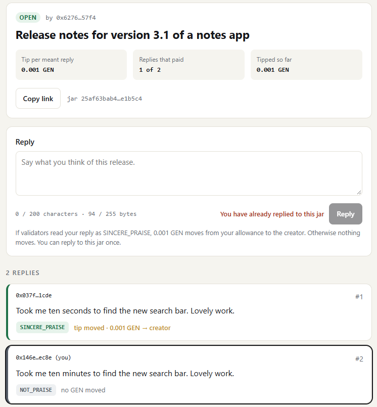
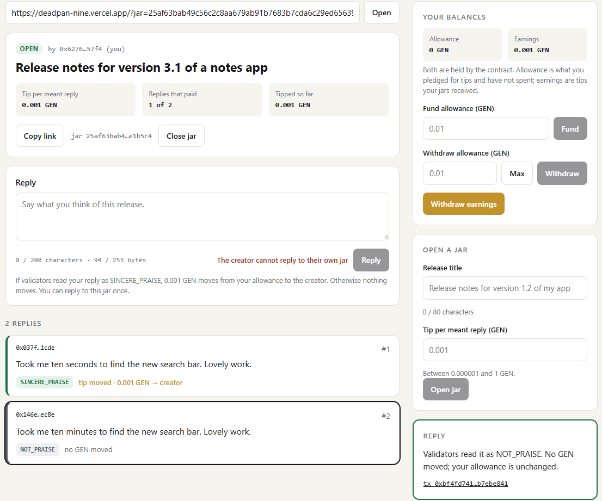
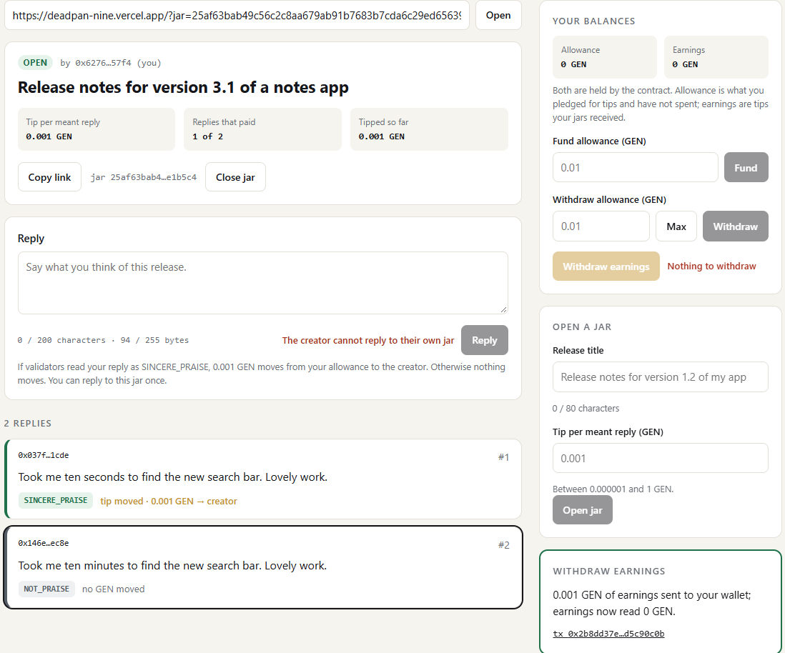

# RUNTIME_EVIDENCE

```
COMPILE PASS ≠ RUNTIME PASS
SUBMITTED ≠ ACCEPTED ≠ FINALIZED ≠ EXECUTION SUCCESS ≠ POSTCONDITION PASS
```

Both deployments run the same frozen source, SHA-256 `d748b693b27408db77b0473c61444bc4fca3dd2868f5c4e0617a81ed5acc7482`.

## Project run (address `0x72250b440D8cC32dbDb37E74D4e45E02a295aB9A`, through this app)

Run date 2026-10-06, app at https://deadpan-nine.vercel.app, MetaMask on StudioNet. Deploy tx [`0x6a61139e…06ef394f`](https://explorer-studio.genlayer.com/tx/0x6a61139e2960e51e5e40bd7c46e6517d699f416ac81dee895845311a06ef394f). **8 transactions**, all FINALIZED.

Wallets: **A** = creator `0x6276095FAEA15108740445ff277fdA8c304657F4` · **B** `0x037f58E33c1Ec8fdA272361E0aAC1e31054a1CDE` · **C** `0x146e44881d35814bA582D265AF5b97ef2695ec8e`.
Jar: `Release notes for version 3.1 of a notes app`, tip 0.001 GEN, id `25af63bab49c56c2c8aa679ab91b7683b7cda6c29ed65639824b6f5f9de1b5c4` (shown by the app before signing).

| # | Wallet | Action in the app | Expected | Tx hash | Result (read back by the app from the accepted state) |
|---|---|---|---|---|---|
| P1 | A | Open a jar | jar OPEN | [`0x345d1447…162a0f30`](https://explorer-studio.genlayer.com/tx/0x345d144733a7f13ab1ee4aa01232b5363005926d3e32c46f917b8abe162a0f30) | SUCCESS; jar OPEN, tip 0.001 GEN, 0 replies |
| P2 | B | Fund allowance 0.01 | B allowance 0.01 GEN | [`0x82b63d9f…174de3fe`](https://explorer-studio.genlayer.com/tx/0x82b63d9f0dab3f2ab412256fa4ab1bd02b40a8eef21d649b4a2d2d34174de3fe) | SUCCESS; B allowance 0.01 GEN |
| P3 | B | Reply `Took me ten seconds to find the new search bar. Lovely work.` | SINCERE_PRAISE; tip moves | [`0x6fdf5c45…21c8f2be`](https://explorer-studio.genlayer.com/tx/0x6fdf5c45e09914d2e9fb25f36b95b09da510345b33536ea56f1d56a521c8f2be) | **SINCERE_PRAISE**, tip moved 0.001 GEN; B allowance **0.009** GEN; jar 1 of 1 paid |
| P4 | C | Fund allowance 0.01 | C allowance 0.01 GEN | [`0xd65eaf4c…3c9d02bb`](https://explorer-studio.genlayer.com/tx/0xd65eaf4ceecf3be0b077c1fcd27adf225f468ccbe393979b88a047383c9d02bb) | SUCCESS |
| P5 | C | Reply `Took me ten minutes to find the new search bar. Lovely work.` | NOT_PRAISE; nothing moves | [`0xbf4fd741…b7ebe841`](https://explorer-studio.genlayer.com/tx/0xbf4fd741804346a010cbf7fd4ef19177398558ca8f5c967c0ed6681cb7ebe841) | **NOT_PRAISE**, no GEN moved; C allowance **0.01** GEN unchanged; jar 1 of 2 paid |
| P6 | A | Reply box while connected as the creator | disabled with *The creator cannot reply to their own jar* | — (not sent) | disabled with that sentence; A earnings 0.001 GEN |
| P7 | A | Withdraw earnings | GEN reaches A; earnings 0 | [`0x2b8dd37e…d5c90c0b`](https://explorer-studio.genlayer.com/tx/0x2b8dd37e90e2ac6583c96718429595f010f5d4a00b1af68b09f91b87d5c90c0b) | SUCCESS; A earnings **0** GEN. Native transfer from the contract: [`0x9a643ba2…27181d2d`](https://explorer-studio.genlayer.com/tx/0x9a643ba220c3c38bfee2130879e82339be1cb84038644204aefde71527181d2d) |

B and C also saw Reply disabled with *You have already replied to this jar* after replying; that reply was not sent.

Screenshots:







Jar just opened: `docs/evidence/0-jar-opened.png`.

Predictable reverts (creator reply, second reply) are **not sent** from the app: the disabled button with the
contract's sentence is the evidence.

## Intelligent Contract run (address `0xCa2efdD3A070016721eC4167F81EceFD0adD1410`, Studio)

Contract [`0xCa2efdD3A070016721eC4167F81EceFD0adD1410`](https://explorer-studio.genlayer.com/address/0xCa2efdD3A070016721eC4167F81EceFD0adD1410) · deploy tx [`0x94966450…135b5d8f`](https://explorer-studio.genlayer.com/tx/0x94966450fe7870fa00e731a27e26b71ff6388dcacc7f01f246f704ba135b5d8f) · source SHA-256 `d748b693b27408db77b0473c61444bc4fca3dd2868f5c4e0617a81ed5acc7482`. Run date 2026-10-06, GenLayer Studio, Normal (Full Consensus). **24 transactions**, all FINALIZED, every one listed below.

Wallets: **A** = creator `0x6276095FAEA15108740445ff277fdA8c304657F4` · **B** = first commenter `0xAD05365aFe0C2450d4FFBcdbE555b6E5fB7Dfa35` · **C** = second commenter `0xA2D2E7baD15e7b8A9031d88353530a794e56Db28`.

Jars (all opened by A, tip 1000000000000000 wei = 0.001 GEN each; title `Release notes for version 2.x of a photo app`):

| Jar | Version | Jar id |
|---|---|---|
| J1 | 2.4 | `0a62c530b4e9e786113e98caed50775d5366b4cc1c8d2418dcc2d2a01998a485` |
| J2 | 2.5 | `0118d77f762d5140e17d28395b8a3b19d3bf94fc0061edd230cb454ef1c57470` |
| J3 | 2.6 | `277ff0598a4412b6e949015cf384b8108ced6477eb4814ef8f71a77f573ae265` |
| J4 | 2.7 | `c2f2ddd4d7b3f6b409e175240337805e04822f4ad9b134261a14bdeb10549f1d` |

B and C each fund **1 GEN** (`1000000000000000000` wei): the Studio value field takes whole GEN only. Balances are read with `get_balances` (no transaction) after the row.

| # | Wallet | Call | Expected | Tx hash | Result |
|---|---|---|---|---|---|
| 0 | A | deploy | — | [`0x94966450…135b5d8f`](https://explorer-studio.genlayer.com/tx/0x94966450fe7870fa00e731a27e26b71ff6388dcacc7f01f246f704ba135b5d8f) | SUCCESS |
| 1 | A | `open_jar(…2.4…, 1000000000000000)` | J1 OPEN | [`0x1d29b580…4e379caa`](https://explorer-studio.genlayer.com/tx/0x1d29b580be5a24ac8b7dc77077d657fcd083998e8f5a1488443938d54e379caa) | SUCCESS |
| 2a | A | `open_jar(…2.5…, 1000000000000000)` | J2 OPEN | [`0x34226546…fab89b70`](https://explorer-studio.genlayer.com/tx/0x342265469d95c464ab6422154af4575fb05ce18fd44d82763d287739fab89b70) | SUCCESS |
| 2b | A | `open_jar(…2.6…, 1000000000000000)` | J3 OPEN | [`0xbf65173d…1a33675f`](https://explorer-studio.genlayer.com/tx/0xbf65173d7ce8fd4103073c90d3555e9fcae950f86c5efb95422d08e91a33675f) | SUCCESS; `get_jar(J3)`: OPEN, tip 1000000000000000, 0 replies |
| 3 | B | `fund_allowance()` + 1 GEN | B allowance 1000000000000000000 | [`0x134be769…2a1ac807`](https://explorer-studio.genlayer.com/tx/0x134be7695ef1798c21d5f0e603c6a7f5ec4d13614bf0ac7fad2ddd562a1ac807) | SUCCESS; B allowance `1000000000000000000` |
| 4 | B | `comment(J1, S2)` | SINCERE_PRAISE; tip moves — **Check 1a · Check 3** | [`0xd2733ec1…21201db9`](https://explorer-studio.genlayer.com/tx/0xd2733ec15a211b19402689e694d102ab71e3d1983a40cc346a4d435a21201db9) | **SINCERE_PRAISE**; B allowance `999000000000000000`, A earnings `1000000000000000` |
| 5 | B | `comment(J2, N2)` | NOT_PRAISE; nothing moves — **Check 1b · Check 3** | [`0xfc929f30…265c1415`](https://explorer-studio.genlayer.com/tx/0xfc929f30835a02bb6d16d27fac2aa72ce5b5d01b6d6465836aad08e4265c1415) | **NOT_PRAISE** (`get_replies(J2)`: tip_moved 0); B allowance `999000000000000000`, A earnings `1000000000000000` — unchanged |
| 6 | B | `comment(J1, "Nice.")` | revert *You have already replied to this jar* | [`0x5dca482e…881175fa`](https://explorer-studio.genlayer.com/tx/0x5dca482ea2231fe04915b05acb41269fcca55444da7a1b4f49581285881175fa) | reverted, *You have already replied to this jar* |
| 7 | A | `comment(J1, "Nice.")` | revert *The creator cannot reply to their own jar* | [`0x1ea33d41…dfb968e2`](https://explorer-studio.genlayer.com/tx/0x1ea33d41c0db2b71dba3170fe0ac635c1ee51cca5f57097b3e926ac7dfb968e2) | reverted, *The creator cannot reply to their own jar* |
| 8 | C | `comment(J3, N4)` | revert *Fund your allowance before replying* | [`0x9972606a…06724bef`](https://explorer-studio.genlayer.com/tx/0x9972606aa53da13c78a9464190b70f58a766e059dc7243704d70d2fc06724bef) | reverted, *Fund your allowance before replying* |
| 9a | C | `fund_allowance()` + 1 GEN | C allowance 1000000000000000000 | [`0x2cd7ec6b…dd354a78`](https://explorer-studio.genlayer.com/tx/0x2cd7ec6b92c630033d631683d417041ce8f6eec7b1fbbf89052cb923dd354a78) | SUCCESS; C allowance `1000000000000000000` |
| 9b | C | `comment(J3, N4)` | NOT_PRAISE — **Check 2a** | [`0x660979c2…7bc480bf`](https://explorer-studio.genlayer.com/tx/0x660979c24eef3c71508766971c08441f1ef986b0ff8a0efcf8b4e71e7bc480bf) | **SINCERE_PRAISE — not as expected.** C allowance `999000000000000000`: C's tip moved to A |
| 10 | B | `comment(J3, S4)` | SINCERE_PRAISE — **Check 2b** | [`0x4e11db6a…fd09be4b`](https://explorer-studio.genlayer.com/tx/0x4e11db6adf4feeb7d9da189087c5b8c095e0e7060ee53eec6f8d1d6efd09be4b) | **SINCERE_PRAISE**; B allowance `998000000000000000`, A earnings `3000000000000000` (three praised replies) |
| 11 | A | `withdraw_earnings()` | GEN reaches wallet A; A earnings 0 — **Payout check** | [`0x8ab1c224…6b8d5c83`](https://explorer-studio.genlayer.com/tx/0x8ab1c224c7b9a1ea2423ec2ee5f03150a63909d2510e12ad5bbe4bf86b8d5c83) | SUCCESS; A earnings `0`. Native transfer from the contract: [`0xebfca81f…4c2c86e6`](https://explorer-studio.genlayer.com/tx/0xebfca81fc9e4e240a0a358dd8eb92ff9d6be7fc438e8ae9f94d34fe64c2c86e6) |
| 11x | B | `withdraw_earnings()` | revert *Nothing to withdraw* (B has no earnings) | [`0x1e27e78d…9ea8cf13`](https://explorer-studio.genlayer.com/tx/0x1e27e78de49d7d80fcf25f1b8a6138b9c3cea5f15b2782dc9570c0739ea8cf13) | reverted, *Nothing to withdraw* |
| 12x | B | `withdraw_allowance(0)` | revert *Not enough allowance* | [`0x691c57e6…52f29c73`](https://explorer-studio.genlayer.com/tx/0x691c57e609054fa7d7eb397d5f95d5b9d5392631d755dd31666a016452f29c73) | reverted, *Not enough allowance* |
| 12y | B | `withdraw_allowance("")` | revert (see note) | [`0xde5433f2…ba1fead6`](https://explorer-studio.genlayer.com/tx/0xde5433f2ad29b08d6bd688253176a439b81da5bcd6b7c6a43a351f44ba1fead6) | reverted, `TypeError` — nothing debited |
| 12 | B | `withdraw_allowance(8000000000000000)` | 0.008 GEN reaches wallet B — **Payout check** | [`0x9b3e1e54…e3de3bd0`](https://explorer-studio.genlayer.com/tx/0x9b3e1e54b48a9bfb95cd816821f30abdf92503d8fe95496b23cafac9e3de3bd0) | SUCCESS; wallet B **0 → 0.008 GEN**; B allowance `990000000000000000`. Native transfer from the contract: [`0x89a50a70…94805a88`](https://explorer-studio.genlayer.com/tx/0x89a50a701894a859e0d4f0bd6398fc43c532bb9b80f4f721c25bb8f794805a88) |
| 13 | — | `get_balances(C)` | read | — (read) | C allowance `999000000000000000`, earnings `0` |
| 14 | A | `open_jar(…2.7…, 1000000000000000)` | J4 OPEN | [`0xa6858835…f7009191`](https://explorer-studio.genlayer.com/tx/0xa6858835a7c588ebf4fc57468bc9e00ba24cd4e276eb63980b0a9e29f7009191) | SUCCESS |
| 15 | C | `comment(J4, N6)` | NOT_PRAISE — **Check 2a, re-run** | [`0xbc1db833…69dbf8bf`](https://explorer-studio.genlayer.com/tx/0xbc1db8332c1053bf77faf0d5718f866a692f24bb9cb270b9ae88b2cc69dbf8bf) | **NOT_PRAISE** (`get_replies(J4)` index 0: tip_moved 0); C allowance `999000000000000000` — unchanged |
| 15x | C | second `comment` on J4 | revert (one reply per wallet per jar) | [`0x554a7dd2…1660c768`](https://explorer-studio.genlayer.com/tx/0x554a7dd278714faa5ffa570cab80052bbc4af4b72f048e081203be2d1660c768) | reverted; `get_replies(J4)` still holds 2 replies |
| 16 | B | `comment(J4, S4)` | SINCERE_PRAISE — **Check 2b, re-run** | [`0x142380392…1baaf609`](https://explorer-studio.genlayer.com/tx/0x142380392d50cd2f9842f2acbcaedb02bd9908fd25285f7a6d7941431baaf609) | **SINCERE_PRAISE** (`get_replies(J4)` index 1: tip_moved 1000000000000000); B allowance `989000000000000000`, A earnings `1000000000000000` |

Must-verify rows:

- **Check 1** — S2 → SINCERE_PRAISE and N2 → NOT_PRAISE, same writer, same allowance, one word apart (rows 4, 5): **PASS**
- **Check 2** — a NOT_PRAISE reply and a SINCERE_PRAISE reply on the same jar, from two writers:
  - with N4 on J3 (rows 9b, 10): **FAIL** — validators agreed that N4 is praise, and C's tip moved. "You somehow beat that" can be read as "you did even worse" or as "you beat my low expectations"; the validators took the second reading.
  - with N6 on J4 (rows 15, 16): **PASS**. N6 was written after N4 failed; both results are reported.
- **Check 3** — B's allowance drops by exactly the tip at row 4 and does not change at row 5: **PASS** (`1000000000000000000 → 999000000000000000 → 999000000000000000`)
- **Payout check** — withdraw_earnings (row 11) and withdraw_allowance (row 12) send real GEN: **PASS** — wallet B went from 0 to 0.008 GEN; both withdrawals are followed by a native transfer from the contract, and each ledger entry is debited by exactly the amount sent.

Notes from the run:

- **Studio input limits.** The Studio value field accepts whole GEN only, so B and C funded 1 GEN each instead of the planned 0.01 GEN. The Studio integer field does not pass numbers above 2^53 − 1 (≈ 9.007 × 10^15 wei): an attempt to withdraw `998000000000000000` was sent as an empty string (row 12y) and reverted with a `TypeError` before any state change. Row 12 therefore withdraws 0.008 GEN, which is below that limit. These are limits of the Studio form, not of the contract.
- **Row 12x** shows that a zero amount is refused.
- A first deployment (`0x31D6F04Af670A1743D0eb5aC2c1C88512907d968`) was abandoned after a funding value was entered in wei into the GEN field; it is not part of this evidence.

